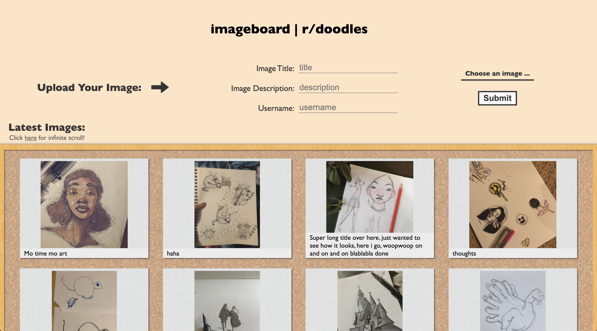
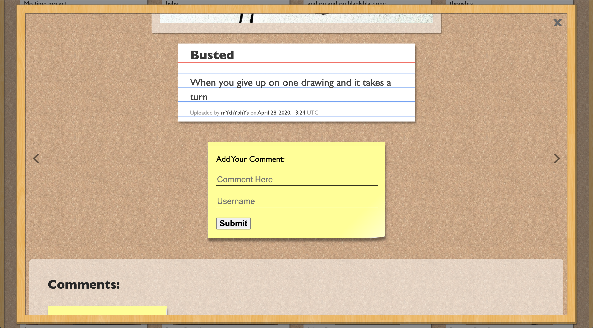
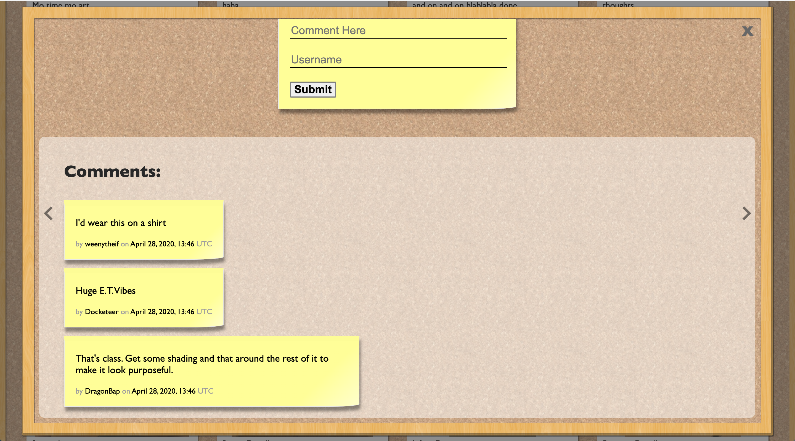

# Imageboard

This imageboard is a sketch-themed, single-page, Vue.js web application for uploading and commenting on images. For demonstration purposes the images and their titles, descriptions and usernames were taken from reddit.com/r/doodles.

Design by Martin Paul

## Features

-   Upload image and give it a title, description and username
-   Post comment on image and provide commenter-name
-   Newly posted image/comment is immediately rendered on page without needing to reload page
-   Infinite-scroll for viewing uploaded images
-   Modal for viewing clicked-on image and related comments
-   View next/prev image in modal by clicking left/right arrow

## Tech Stack

-   Javascript
    -   Vue
    -   Node.js
    -   Express
-   Amazon Web Services - for storing the uploaded images
-   PostgreSQL - for storing
    -   image title, description, username, url, upload-date
    -   comment text, username, comment-date
-   HTML
-   CSS

## Screenshots

### Main Page

### Modal - View Image, Post Comments

